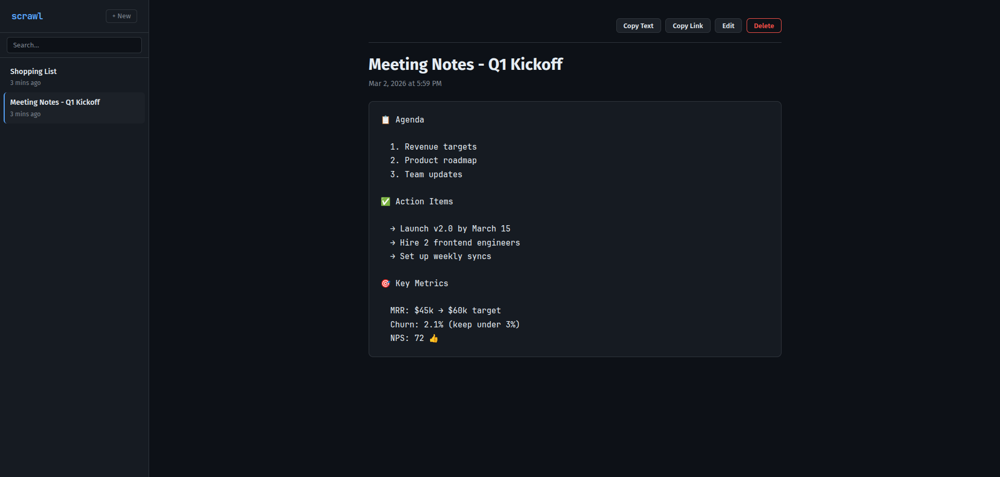
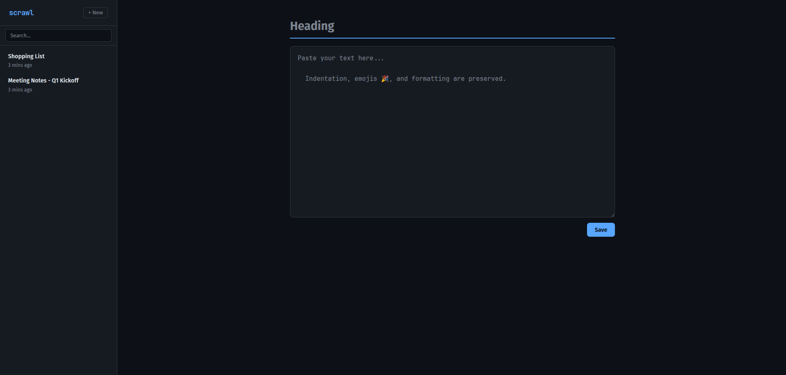

# scrawl

[](https://github.com/dasunNimantha/scrawl/actions/workflows/build.yml)
[](https://go.dev/)
[](https://hub.docker.com/r/dasunnimantha/scrawl)
[](LICENSE)

A blazingly fast, self-hosted text sharing app built with Go and SQLite. Drop in formatted text with emojis, indentation, and structure — get a shareable link instantly.

**Single binary. No accounts. No bloat. No external dependencies.**



---

## Why scrawl?

- You need to share a snippet, meeting notes, or a quick config — not spin up a full pastebin
- You want it **fast**: sub-millisecond responses, gzip-compressed, embedded assets
- You want it **simple**: one binary, one SQLite file, zero config
- You want it **private**: self-hosted, no tracking, no accounts

## Features

| Feature | Details |
|---------|---------|
| **Instant sharing** | Create an entry, get a permanent link |
| **Formatting preserved** | Emojis, indentation, tabs, whitespace — all intact |
| **Full CRUD** | Create, view, edit, delete entries |
| **Password protection** | Optionally lock entries with a password (bcrypt hashed) |
| **Expiring entries** | Optional TTL: 1 hour, 1 day, 7 days, 30 days — default: never |
| **Download as .txt** | Download any entry as a plain text file |
| **Word/char count** | Live word and character count in the editor |
| **Sidebar** | Recent entries always visible, filterable search, lock icon for protected entries |
| **Copy buttons** | Copy shareable link or entry text to clipboard |
| **Keyboard shortcuts** | `Ctrl+Enter` save, `Tab` indent, `Esc` close modal |
| **Gzip compression** | All responses compressed on the fly |
| **Security headers** | CSP, X-Frame-Options, input sanitization |
| **Single binary** | Go executable with embedded assets — nothing else needed |
| **Mobile responsive** | Optimized layout for phones and tablets |
| **Dark theme** | Clean, modern UI that's easy on the eyes |



---

## Quick Start

### Docker Hub (recommended)

```bash
docker run -p 8080:8080 -v scrawl-data:/data dasunnimantha/scrawl
```

Open [http://localhost:8080](http://localhost:8080).

### Docker Compose

```yaml
services:
  scrawl:
    image: dasunnimantha/scrawl
    ports:
      - "8080:8080"
    volumes:
      - scrawl-data:/data
    restart: unless-stopped

volumes:
  scrawl-data:
```

### Build from source

```bash
git clone https://github.com/dasunNimantha/scrawl.git
cd scrawl
go build -o scrawl .
./scrawl
```

## Configuration

| Variable | Default | Description |
|----------|---------|-------------|
| `PORT` | `8080` | HTTP server port |
| `DB_PATH` | `scrawl.db` | SQLite database file path |

```bash
PORT=3000 DB_PATH=/data/scrawl.db ./scrawl
```

## Tech Stack

| Layer | Technology |
|-------|------------|
| **Backend** | Go (stdlib `net/http`, `html/template`, `embed`) |
| **Database** | SQLite via `mattn/go-sqlite3` (WAL mode) |
| **Frontend** | Vanilla HTML/CSS/JS + HTMX (embedded locally) |
| **Dependencies** | 2 (`go-sqlite3`, `x/crypto` for bcrypt) |

## Build

Requires Go 1.22+ and a C compiler (for SQLite CGo bindings).

```bash
# development
go run .

# production binary (stripped)
CGO_ENABLED=1 go build -ldflags="-s -w" -o scrawl .

# run tests
go test -v ./...
```

## Security

scrawl is designed for small trusted teams (5-10 users), not public internet exposure. That said, it ships with sensible defaults:

- **SQL injection** — all queries use parameterized statements
- **XSS** — Go's `html/template` auto-escapes all user content in HTML and JS contexts
- **Security headers** — `Content-Security-Policy`, `X-Frame-Options: DENY`, `X-Content-Type-Options: nosniff`, `Referrer-Policy`, `Permissions-Policy`
- **Input sanitization** — control characters stripped, title length capped at 200 chars
- **Password hashing** — bcrypt with default cost for entry protection
- **Body size limit** — 128KB max on POST/PUT bodies
- **ID validation** — only valid hex IDs accepted in URL paths
- **Dependabot** — automated dependency updates for Go modules and GitHub Actions

## Project Structure

```
scrawl/
├── main.go              # server, routes, middleware, security
├── handlers.go          # HTTP handlers, DB queries, validation
├── handlers_test.go     # integration tests (49 tests)
├── go.mod
├── templates/
│   └── index.html       # all templates (single file)
└── static/
    ├── style.css
    └── htmx.min.js
```

## API

| Method | Path | Description |
|--------|------|-------------|
| `GET` | `/` | Home page with editor |
| `POST` | `/api/entries` | Create entry (optional `password` and `ttl` fields) |
| `GET` | `/e/{id}` | View entry (shareable link) |
| `POST` | `/e/{id}/unlock` | Unlock a password-protected entry |
| `PUT` | `/api/entries/{id}` | Update entry |
| `DELETE` | `/api/entries/{id}` | Delete entry |
| `GET` | `/e/{id}/download` | Download entry as `.txt` |
| `GET` | `/api/entries` | List entries (HTMX) |
| `GET` | `/api/entries/{id}/edit` | Edit form (HTMX) |

## License

[MIT](LICENSE)
